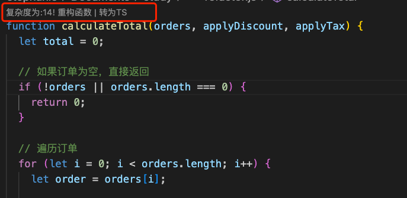

## CodeAssist - Refactor with AI - 函数复杂度检测与重构工具 🚀

一个高效的开发工具，帮助您检测代码中函数的复杂度，提供重构建议，支持将 JavaScript 函数转换为 TypeScript 函数，并提供自定义配置功能以满足团队开发规范。

---

### ✨ 功能介绍

1. **🔍 函数复杂度检测**  
   自动分析代码中的函数复杂度，并在复杂度超标时提示。

2. **🛠️ 复杂函数重构**  
   提供复杂函数和组件函数重构建议，帮助开发者优化复杂函数的结构，提高代码的可读性和可维护性。

3. **🔄 JS 函数转 TS 函数**  
   自动识别 JavaScript 函数，将其转换为带有类型注释的 TypeScript 函数，提升代码的类型安全性。

4. **⚙️ 自定义配置**
   - **复杂度提示阈值**：可配置复杂度检测提示上限。
   - **重构规范**：可配置重构建议的规则，支持团队定制化的开发规范。

---

### 📦 安装方法

1. 打开 VS Code，进入扩展市场（快捷键：`Ctrl+Shift+X`）。
2. 搜索 **"CodeAssist"**。
3. 点击 **安装** 按钮。
4. 安装完成后，重启 VS Code 即可开始使用。 🎉

---

### 🛠️ 使用方法

#### 1. 函数复杂度检测 🔍

- 打开任意代码文件，插件会自动分析文件中函数的复杂度，并在复杂函数上方显示提示信息。

#### 2. 函数重构 🛠️

- 超出复杂度阈值函数上方显示“重构函数”选项，点击建议可自动优化部分代码。

#### 3. JS 函数转 TS 函数 🔄

- JavaScript 函数上方自动显示“转为 TS”选项，点击后插件会自动添加类型注释并优化代码结构。

#### 4. 自定义配置 ⚙️

通过 VS Code 的设置界面或 `settings.json` 配置以下选项：

```json
{
  "codeAssist": {
    "refactorPrinciple": "重构函数遵循规范如下：\n1. 函数名应该以动词开头，描述函数的主要功能。\n2. 函数名应该使用小驼峰命名法。\n3. 函数应该只做一件事情，并且做好这件事情。\n4. 函数的参数应该尽可能少，最好不超过三个。\n5. 函数的返回值应该是明确的，并且与函数的主要功能相关。\n6. 将所有数字、小数、字符串等常量值都提取为大写的常数变量。\n7. 函数的实现应该简单明了，避免过多的嵌套和复杂的逻辑。\n8. 函数的注释应该清晰明了，能够解释函数的功能、参数和返回值。\n9. 函数的实现应该符合编码规范和最佳实践。\n10. 使用ES6语法声明函数。\n11. 函数组件重构时将公共方法抽取为hooks。",
    "complexWarnLimit": 5
  }
}
```

---

### 📖 示例

#### 函数复杂度提示 💡



#### 自动生成重构代码 🛠️

**复杂函数重构：**


**函数组件重构：**


#### JS 函数转 TS 函数 ♻️

## 

### 📝 更新日志

#### v1.0.0 🎉

- 实现函数复杂度检测功能。
- 支持复杂函数的自动重构。
- 提供 JS 函数到 TS 函数的转换功能。
- 增加自定义配置支持。

---

### 🧑‍💻 开发者信息

作者 📮 : fangjie_727@163.com

---

✨ 欢迎提出建议并分享您的使用体验！😊
